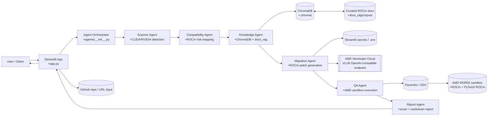

# ROCmForge

**Proof-backed CUDA to ROCm migration for real AI repositories.** ROCmForge scans CUDA-heavy projects, identifies NVIDIA-specific blockers, generates ROCm-compatible patches, validates them in an AMD sandbox, and produces a migration report with measurable readiness gains.

[](https://www.python.org/)
[](https://streamlit.io/)
[](https://www.crewai.com/)
[](https://www.amd.com/en/products/software/rocm.html)
[](https://docs.vllm.ai/)
[](https://www.trychroma.com/)

## Table of Contents

- [What It Does](#what-it-does)
- [Features](#features)
- [Architecture & Workflow](#architecture--workflow)
- [Installation & Setup](#installation--setup)
- [Environment Variables](#environment-variables)
- [Usage Examples](#usage-examples)
- [Project Layout](#project-layout)
- [Notes](#notes)

## What It Does 

ROCmForge is built for the migration gap between CUDA-locked AI code and AMD hardware. It combines static scanning, local ROCm documentation retrieval, structured patch generation, sandbox execution, and benchmark reporting so teams can prove compatibility before deployment.

The current implementation uses a Streamlit application as the primary interface, a CrewAI-driven Python backend for orchestration, ChromaDB for local RAG, and an AMD Developer Cloud sandbox accessed over SSH for runtime validation.

## Features

- CUDA and NVIDIA dependency scanner for Python projects, Dockerfiles, and requirements files.
- Compatibility analysis that turns raw findings into ROCm migration signals and AMD fix hints.
- Local ROCm knowledge retrieval backed by a persistent ChromaDB corpus and sentence-transformer embeddings.
- Structured migration generation that emits targeted edits and ROCm setup notes.
- AMD sandbox validation through SSH and Paramiko, with runtime and GPU memory metrics.
- Readiness scoring and final migration reports that compare the repo before and after the patch.
- Demo-friendly Streamlit UI with cached-run support for reliable presentations.
- Companion React/TanStack/Vite frontend stack in `website/` for the polished dashboard experience.

## Architecture & Workflow



### Workflow Summary

1. A user pastes a script or a GitHub URL into the UI.
2. The scanner finds CUDA calls, NVIDIA base images, and ROCm-incompatible dependencies.
3. The compatibility and knowledge stages enrich each issue with AMD guidance.
4. The migration agent emits a targeted patch and optional ROCm setup files.
5. The QA agent runs the patched project on an AMD sandbox and captures logs, runtime, and memory usage.
6. The report agent compares pre- and post-migration readiness and writes the final markdown summary.

## Installation & Setup

### Prerequisites

- Python 3.11 or newer
- Git
- Access to an AMD Developer Cloud endpoint for live vLLM and sandbox validation

### Local Setup

```powershell
git clone <repo-url>
cd ROCmForge
python -m venv .venv
```

Activate the virtual environment:

```powershell
.\.venv\Scripts\Activate.ps1
```

```bash
source .venv/bin/activate
```

Install dependencies and create the local secrets file:

```powershell
python -m pip install -r requirements.txt
Copy-Item .streamlit/secrets.toml.example .streamlit/secrets.toml
```

```bash
python -m pip install -r requirements.txt
cp .streamlit/secrets.toml.example .streamlit/secrets.toml
```

If you want the local ROCm knowledge base populated before the first run, ingest the curated docs:

```bash
python -m docs_rag.ingest_docs
```

Launch the app:

```bash
streamlit run app.py
```

### Frontend Workspace

The `app.py` website contains the frontend UI used for the dashboard experience.

```powershell
streamlit run app.py
```

## Environment Variables

ROCmForge reads configuration from environment variables, `.env`, or `.streamlit/secrets.toml`.

| Variable | Required | Purpose |
| --- | --- | --- |
| `VLLM_ENDPOINT_URL` | Yes | OpenAI-compatible endpoint served from AMD Developer Cloud. |
| `VLLM_API_KEY` | Yes | Auth token for the vLLM endpoint. |
| `VLLM_MODEL` | No | Overrides the default model name, `Qwen/Qwen2.5-Coder-7B-Instruct`. |
| `AMD_SANDBOX_HOST` | Yes for live QA | SSH host for the AMD sandbox instance. |
| `AMD_SANDBOX_USER` | No | SSH username, defaults to `root`. |
| `AMD_SANDBOX_KEY_PATH` | Yes for live QA | Path to the SSH private key used by Paramiko. |

Example `.streamlit/secrets.toml` values are provided in `.streamlit/secrets.toml.example`.

## Usage Examples

### Scan a Local Project

1. Start the app with `streamlit run app.py`.
2. Paste a local CUDA/PyTorch script into the input area.
3. Review the scan results, generated ROCm patch, QA output, and final report.

### Migrate a GitHub Repository

1. Paste a public GitHub URL into the UI.
2. ROCmForge clones the repository, scans it, and runs the full agent pipeline.
3. The report includes patch text, generated files, QA logs, and readiness scoring.

### Rebuild the Local RAG Index

```bash
python -m docs_rag.ingest_docs
python -m docs_rag.retriever
```

### Run the AMD Sandbox Validator Directly

```bash
python -m core.benchmark_runner
```

## Project Layout

```text
app.py                         # Streamlit entry point
agents/                        # Scanner, compatibility, knowledge, migration, QA, report stages
core/                          # Repo loading, scoring, patching, benchmarking, scanning
docs_rag/                      # Local ROCm documentation corpus + retrieval helpers
examples/broken_cuda_demo/     # Sample failing CUDA project
```

## Notes

- The project is designed around AMD hardware validation, not just static code rewriting.
- Live sandbox execution requires valid SSH access to the AMD host and a working ROCm environment.
- If the sandbox is unavailable, the QA path can fall back to mock results for development, but the README’s full value proposition comes from real AMD execution.
